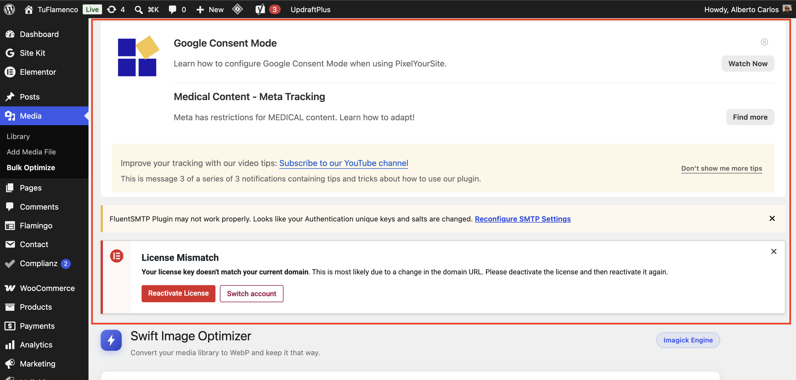
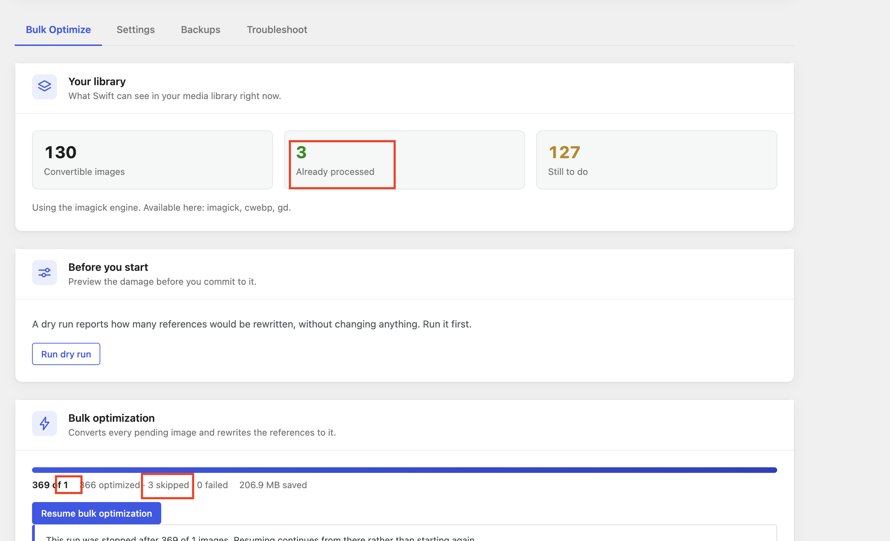

# Current Issues

Known gaps. Nothing here is a live bug in shipped behaviour — these are unverified paths,
environment limits and untested surfaces.

Last reviewed: 2026-08-13, after Unit 14 (I-10 reopened and closed, I-15).

**Open:** I-3, I-4, I-6, I-7, I-8, I-9. **I-10 and I-15 closed in Unit 14**; **I-14 closed in
Unit 12** — see their entries below, and
[specs/done/12-centralized-scan-stats.md](../specs/done/12-centralized-scan-stats.md) for the
detail. Everything else closed has moved to the table at the bottom; the reasoning behind each
closure lives in the unit's spec under [specs/done/](../specs/done/).

Unit 10 is a caution about this file. It closed fourteen defects that were **not** listed here,
three of which destroyed user data, and all of which were found by reading the conversion path
rather than by any test or any entry below. An empty issues list means nobody has looked
recently, not that nothing is wrong.

---

## I-3 — The React dashboard has never been opened in a browser

**Severity:** Medium

Unit 08's media UI is now browser-verified, but the **Bulk Optimize dashboard** (Unit 07) is
not. Its build, asset manifest, enqueue path and every REST endpoint it calls are verified —
but nobody has clicked anything.

Unverified: tab switching, dry-run report rendering, live progress, stop actually stopping,
settings persisting through `/wp/v2/settings`, and the confirm dialogs.

**Fix:** a manual pass. The media UI check took about ten minutes and found the CLI/web Imagick
split, so this is worth doing properly.

**Unit 10 update:** the settings write path *is* now confirmed live — toggling Enable Log on the
new Troubleshoot tab saved through `/wp/v2/settings` and fired the transition hook, whose `MARK`
line is in the log file. Everything else in this entry still stands, and Unit 10 added a fourth
tab's worth of unclicked surface: the diagnostics table, the log viewer, Download, Reset,
Requeue and Clean up.

**Unit 11 update:** the notice/Toast rework (I-10) is also unverified in a browser — it belongs
to this entry now.

**Unit 14 update:** two more things land here. The notice suppression is proven against
WordPress's real `WP_Hook` in `tests/php/notice-strip-test.php`, but nobody has loaded the screen
to see the notices gone. And the I-15 spacing fix was made from the source and verified through
the compiled CSS — if the boxes were genuinely *overlapping* rather than merely touching, that
cause is still unfound and only a browser will show it.

---

## I-4 — WP-CLI commands are partly verified at runtime

**Severity:** Low (was Medium)

**Mostly closed in Unit 10.** WP-CLI turned out to be available after all, via Local's bundled
phar driven by Local's PHP with the site's MySQL socket:

```bash
PHP="/Applications/Local.app/Contents/Resources/extraResources/lightning-services/php-8.2.29+0/bin/darwin-arm64/bin/php"
WP="/Applications/Local.app/Contents/Resources/extraResources/bin/wp-cli/posix/wp"
SOCK="$HOME/Library/Application Support/Local/run/aRpCXvFUz/mysql/mysqld.sock"
"$PHP" -d mysqli.default_socket="$SOCK" "$WP" swift-image-optimizer diagnostics
```

Confirm `option get siteurl` returns `https://cb-test.local` before trusting anything — that
command pairing is the guard against the two-database trap in [fix-plan.md](fix-plan.md).

Exercised live: `optimize --id`, `restore --id`, `stats`, `diagnostics`, `logs`,
`logs --reset`, `requeue`. **Not yet exercised:** `optimize --all`, `optimize --dry-run`,
`restore --all`, and the `--limit` / `--batch` flags — which is to say the bulk paths, still the
recommended route for large libraries.

---

## I-6 — Multisite is unconsidered

**Severity:** Unknown

No testing, no review of per-site table handling, no thought given to network activation or
shared uploads directories. The plugin may work fine or may be actively wrong.

**Fix:** either test and support it, or declare it unsupported in `readme.txt`. Silence is the
worst option.

---

## I-7 — Dry-run extrapolation is a linear estimate

**Severity:** Low

`Bulk\Runner::dry_run()` samples 25 attachments and scales the reference count linearly. On a
library with uneven reference density — a few images used everywhere, most used nowhere — that
estimate will be well off.

Acceptable as a "roughly how much will change" signal. The UI says "Estimated", which is
correct. Keep it that way.

---

## I-8 — A backup manifest can become unreachable, with no repair path

**Severity:** Low

**Half of this closed in Unit 10.** The direction that had actually bitten us — files vanishing
while the column still advertised them, leaving `canRestore: true` on a Restore that would fail
— is fixed. `BackupManager::manifest_is_intact()` checks every named file on disk, and both the
media modal and the list-table row action now ask it rather than trusting the column. That was
the concrete case behind the incident in [fix-plan.md](fix-plan.md).

**What remains:** `backup_path` still stores `{relative_dir, files[], expires}` as JSON in a TEXT
column. If that value is truncated or malformed, the files are on disk but unreachable, and
there is no routine that reconciles the two. Restore now fails cleanly with `backup-expired`
instead of misleading the user, so this is a recoverability gap rather than a correctness one.

**Fix when it matters:** a reconcile routine that walks the backup directory and rebuilds
manifests from what is actually there.

---

## I-9 — Time-based backup expiry is untested with real aged data

**Severity:** Low

`RetentionCron::purge()` has only been exercised via artificially expired rows. A backup that
genuinely aged past its retention window has never been observed being collected.

**Fix:** set `backup_expires` to a past timestamp on a real backup and run the cron hook.


## I-10 — Other plugins' notices on this plugin's screen

Other plugis notice is showing here , need to remove this, In this plugin
UI only plugin custom notice and toasts will be shown. no wordpress notice and other plugin
notices.

**Closed in Unit 14.** Reopened, not regressed: Unit 11 fixed the half the plugin owned — it
stopped emitting core's `notice` markup and stopped hooking `admin_notices` on every admin screen
— and then deliberately *positioned* foreign notices above the app rather than removing them, on
the reasoning that hiding them "would be its own kind of rude". `image-6.png` is what that
decision looks like on a real site. The user overruled it.

`ForeignNoticeHandler` now runs on `in_admin_header` and, **on this plugin's screen only**,
removes every callback on `admin_notices`, `all_admin_notices`, `user_admin_notices` and
`network_admin_notices` that is not this plugin's own. It removes by callback rather than calling
`remove_all_actions()`, because `MenuHandler::missing_build_notice` has to survive: when the
bundle is absent React renders nothing, so that notice is the only thing that can speak.
`upload.php` and `plugins.php` are untouched — clearing a screen you own is fine, clearing core's
is not. `swift_image_optimizer_hide_foreign_notices` is the escape hatch. Covered by
`tests/php/notice-strip-test.php` (9 assertions), which runs against WordPress's real `WP_Hook`
rather than a stub of it. Detail:
[specs/done/14-notices-and-card-spacing.md](../specs/done/14-notices-and-card-spacing.md).


**Closed in Unit 14.** Three separate omissions, all in `resources/styles/admin.scss`:

| Symptom | Cause |
|---|---|
| The info notice sits flush against the Bulk optimize button | `.sio-notice` carries `margin: 0 0 16px` — bottom only, so nothing separates it from what precedes it |
| Dead strip under the last notice in a card | The same bottom margin, on top of the card body's own padding |
| "Preview what would change" unstyled and flush against the button | `.sio-dryrun__panel` had **no rule at all** — it rendered with the browser default marker and zero margins |

Fixed with `.sio-actions + .sio-notice`, `.sio-card__body > :last-child`, and a
`.sio-dryrun__panel` block following `.sio-scanmeta__details`. The notice stayed below the button
by the user's decision — the reading order was not the complaint, the spacing was.

**One thing not established:** no rule in the source produces literal *overlap*, only zero
separation, which is what the screenshot's abutting boxes are consistent with. Fixed on that
reading and verified through the compiled CSS, not in a browser — see **I-3**. If the boxes still
overlap on a real page load, that is a distinct defect and this entry is wrong.

## I-14 - Bulk Optimizations and Stats needs to be centralized

**Closed in Unit 12.** Renumbered from I-11, which `progress-tracker.md` already used for Unit
11's "one storage folder" fix — the two collided under one number.

The numbers are not making any sense at all when used in a site - need to make the two section into one where there will be a scan button, Circular progress bar showing the image optmization stats. The scan feature will be in same way like asyncronus or corn not depending on the page reload. One scan is requested, the button will be disabled, an after the scan complete and updated the stats, the button will be enabled again. The scan can be initiated from the button click, and run in a interval of time from the settings options for daily, weekly, monthly. based on this scan the stats will be shown, not from the database or wrong assumption data. Last scan time will be also shwon.

For bulk optimization when bulk optimization Button is Clicked, it will first scan and get the latest results, then optmize them, then scan again to find the upadted result after scan and then update the stats, database optoions or views.

**What shipped:** `Scanner::summary()`'s "already processed" was `total - pending`, both shrinking
together as images converted (mime flips to `image/webp` on success, leaving `total`'s jpeg/png
count) — that arithmetic never had a reason to reconcile, and neither did `Runner`'s frozen `total`
against a monotonic `done` ("369 of 1"). Replaced with one stored, disk-verified scan snapshot
(`ScanRunner`, batched, cron-driven) that the ring, hero and tiles all read — nothing on the
dashboard is inferred from the log table anymore. Bulk Optimize now chains scan → optimize → scan
via `Coordinator`. Scheduled rescans (manual/daily/weekly/monthly, default weekly) via
`ScanJobRunner`, mirroring `BulkJobRunner`'s in-process cron pattern. One deliberate deviation
from the literal ask: the Scan button re-enables on a stalled scan rather than staying disabled
forever, because WP-Cron only fires on a request and a literal read would strand the button dead
on a quiet site. Full detail: [specs/done/12-centralized-scan-stats.md](../specs/done/12-centralized-scan-stats.md).

Scan or Bulk Optimziation sould not freeze the website, it should process them in background and when completed them udpate the UI and database results