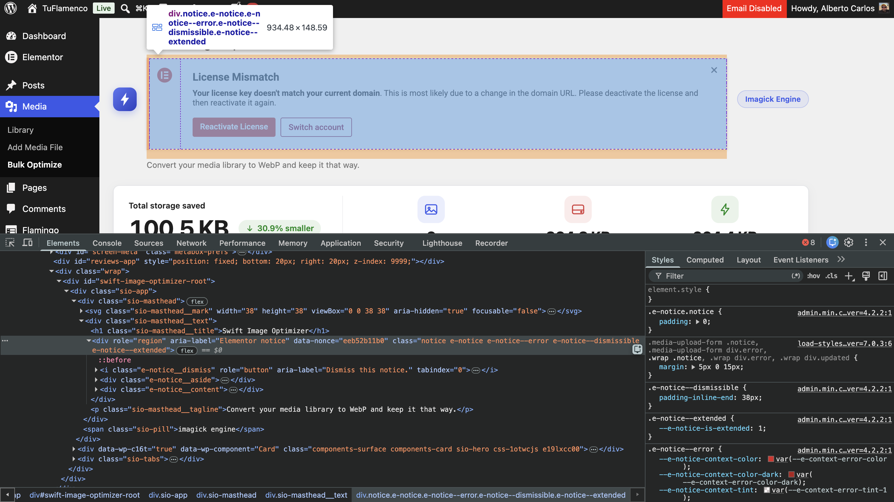
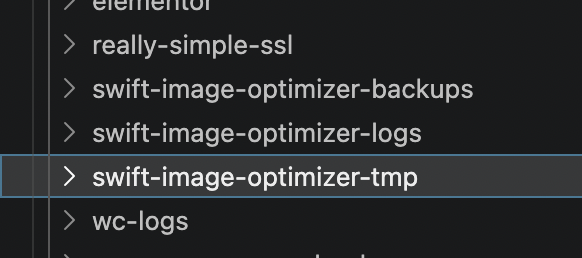
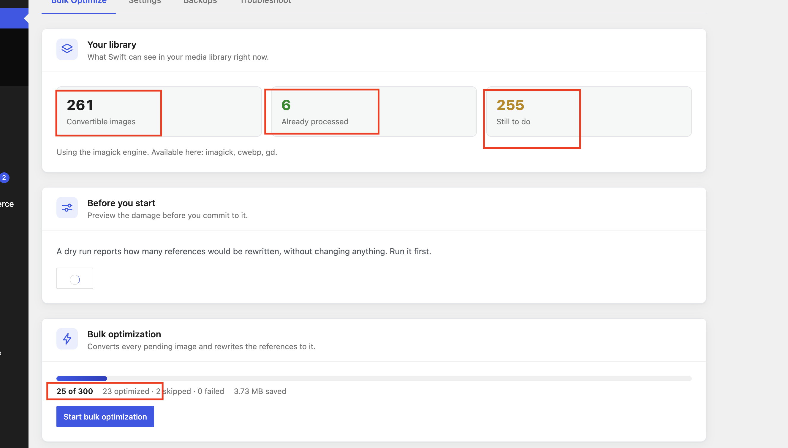
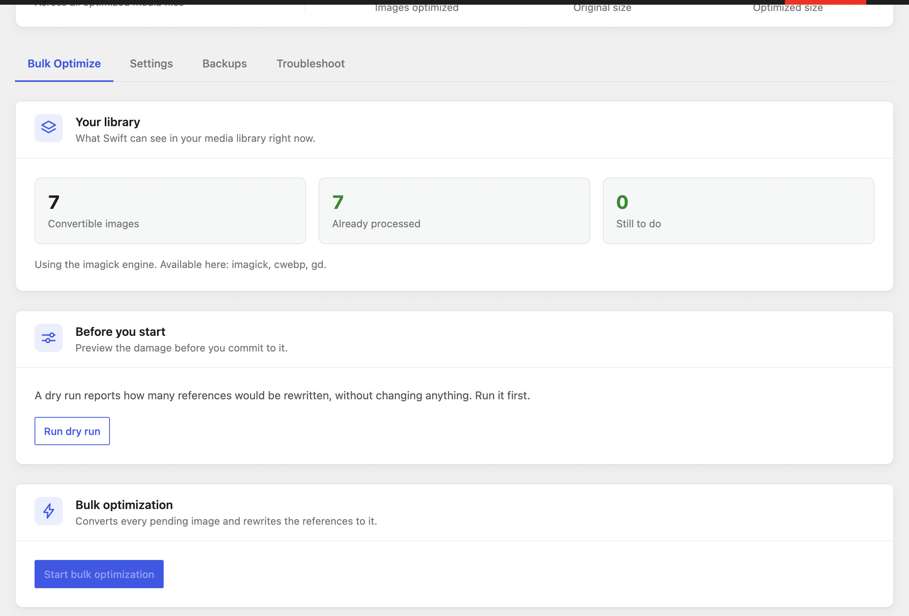
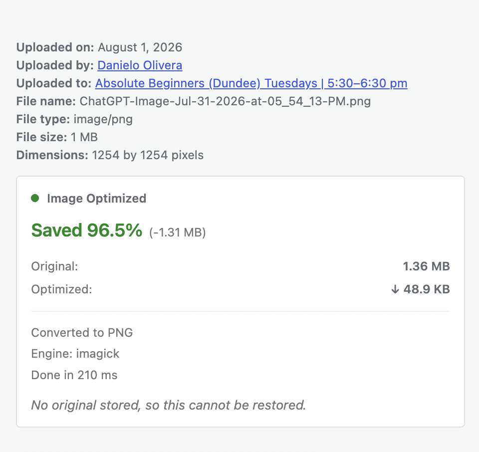
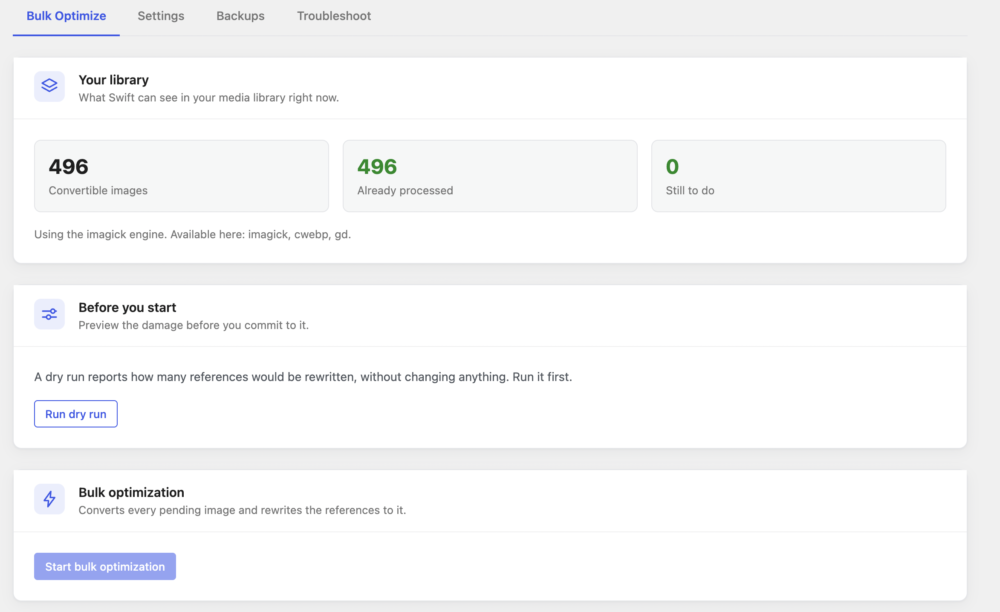

# Current Issues

Known gaps. Nothing here is a live bug in shipped behaviour — these are unverified paths,
environment limits and untested surfaces.

Last reviewed: 2026-08-10, after Unit 10 (Hardening + Troubleshoot).

Unit 10 is a caution about this file. It closed fourteen defects that were **not** listed here,
three of which destroyed user data, and all of which were found by reading the conversion path
rather than by any test or any entry below. An empty issues list means nobody has looked
recently, not that nothing is wrong.

---

## I-1 — PHPCS has never been run · **blocks release**

**Severity:** High (blocks WordPress.org submission)

WPCS is not installed in this environment, so `phpcs.xml.dist` has never executed. Every file is
*written* to WordPress standards, with justification comments on all direct queries and silenced
errors, but no linter has confirmed it.

Calling the plugin ".org compliant" today is an intention, not a verified fact.

**Fix:** [specs/09-phpcs-compliance.md](../specs/09-phpcs-compliance.md)

---

## I-2 — The test suite exercises a different engine than the site runs

**Severity:** High

The environment has a split that produced a materially wrong report earlier in this project:

| Context | Imagick | Engine actually used |
|---|---|---|
| Local's **CLI** PHP (all builds 7.4 → 8.4) | absent | `cwebp` |
| The site's **web/php-fpm** request | **present** | `imagick` |

Every harness runs under CLI PHP, so **all 143 assertions exercise the cwebp path**. The site
itself runs Imagick. Confirmed via `/scan` from the browser:
`{"imagick":true,"cwebp":true,"gd":true}`.

This supersedes the earlier claim that "ImagickEngine has never executed" — it has, in
production on cb-test, producing a correct 92.1% conversion. But it remains **untested by the
suite**.

**Fix:** force the engine per-run in the harnesses (`Settings::engine`) and run each suite three
times, once per engine. Until then, do not describe Imagick as covered by tests.

**Unit 10 update — this gap has now cost us something concrete.** `CwebpEngine` never applied
EXIF orientation and passed `-metadata icc`, which discards the orientation flag, so every
portrait photo it converted was written permanently sideways. It survived because cwebp is the
engine the harnesses run and *nobody looked at the output*, only at the return value. The bug is
fixed (the engine now declines rotated JPEGs and the chain falls through), and it was reproduced
and verified live on cb-test — but the lesson stands: exercising an engine is not the same as
checking what it produced. Unit 10's live verification covered `cwebp` and `gd`. **Imagick is
still uncovered.**

---

## I-3 — The React dashboard has never been opened in a browser

**Severity:** Medium

Unit 08's media UI is now browser-verified, but the **Bulk Optimize dashboard** (Unit 07) is
not. Its build, asset manifest, enqueue path and every REST endpoint it calls are verified —
but nobody has clicked anything.

Unverified: tab switching, dry-run report rendering, live progress, stop actually stopping,
settings persisting through `/wp/v2/settings`, and the confirm dialogs.

**Fix:** a manual pass. The media UI check took about ten minutes and found the environment
issue above, so this is worth doing properly.

**Unit 10 update:** the settings write path *is* now confirmed live — toggling Enable Log on the
new Troubleshoot tab saved through `/wp/v2/settings` and fired the transition hook, whose `MARK`
line is in the log file. Everything else in this entry still stands, and Unit 10 added a fourth
tab's worth of unclicked surface: the diagnostics table, the log viewer, Download, Reset,
Requeue and Clean up.

---

## I-4 — WP-CLI commands are partly verified at runtime

**Severity:** Low (was Medium)

**Mostly closed in Unit 10.** WP-CLI turned out to be available after all, via Local's bundled
phar driven by Local's PHP with the site's MySQL socket:

```bash
PHP="/Applications/Local.app/Contents/Resources/extraResources/lightning-services/php-8.2.29+0/bin/darwin-arm64/bin/php"
WP="/Applications/Local.app/Contents/Resources/extraResources/bin/wp-cli/posix/wp"
SOCK="$HOME/Library/Application Support/Local/run/aRpCXvFUz/mysql/mysqld.sock"
"$PHP" -d mysqli.default_socket="$SOCK" "$WP" swift-image-optimizer diagnostics
```

Confirm `option get siteurl` returns `https://cb-test.local` before trusting anything — that
command pairing is the guard against the two-database trap in [fix-plan.md](fix-plan.md).

Exercised live: `optimize --id`, `restore --id`, `stats`, `diagnostics`, `logs`,
`logs --reset`, `requeue`. **Not yet exercised:** `optimize --all`, `optimize --dry-run`,
`restore --all`, and the `--limit` / `--batch` flags — which is to say the bulk paths, still the
recommended route for large libraries.

---

## I-6 — Multisite is unconsidered

**Severity:** Unknown

No testing, no review of per-site table handling, no thought given to network activation or
shared uploads directories. The plugin may work fine or may be actively wrong.

**Fix:** either test and support it, or declare it unsupported in `readme.txt`. Silence is the
worst option.

---

## I-7 — Dry-run extrapolation is a linear estimate

**Severity:** Low

`Bulk\Runner::dry_run()` samples 25 attachments and scales the reference count linearly. On a
library with uneven reference density — a few images used everywhere, most used nowhere — that
estimate will be well off.

Acceptable as a "roughly how much will change" signal. The UI says "Estimated", which is
correct. Keep it that way.

---

## I-8 — A backup manifest can become unreachable, with no repair path

**Severity:** Low

**Half of this closed in Unit 10.** The direction that had actually bitten us — files vanishing
while the column still advertised them, leaving `canRestore: true` on a Restore that would fail
— is fixed. `BackupManager::manifest_is_intact()` checks every named file on disk, and both the
media modal and the list-table row action now ask it rather than trusting the column. That was
the concrete case behind the incident in [fix-plan.md](fix-plan.md).

**What remains:** `backup_path` still stores `{relative_dir, files[], expires}` as JSON in a TEXT
column. If that value is truncated or malformed, the files are on disk but unreachable, and
there is no routine that reconciles the two. Restore now fails cleanly with `backup-expired`
instead of misleading the user, so this is a recoverability gap rather than a correctness one.

**Fix when it matters:** a reconcile routine that walks the backup directory and rebuilds
manifests from what is actually there.

---

## I-9 — Time-based backup expiry is untested with real aged data

**Severity:** Low

`RetentionCron::purge()` has only been exercised via artificially expired rows. A backup that
genuinely aged past its retention window has never been observed being collected.

**Fix:** set `backup_expires` to a past timestamp on a real backup and run the cron hook.

---

## Resolved

| Was | Outcome |
|---|---|
| **Media grid modal shows nothing** | Fixed in Unit 08; verified live in all three panel states |
| **ImagickEngine has never executed** | False — it is the production engine on cb-test. Reframed as I-2, which is the real (and different) problem |
| **496 orphaned attachments** | **Invalid finding.** An artifact of testing cb-test's *files* against TuFlamenco's *database*. cb-test has 62 attachments and 0 missing files. The spec built on this has been deleted |
| **I-5 — upload-optimized images cannot be restored** | Settled with the user in Unit 10: uploads are backed up too, behind `backup_uploads`, default on. Restore works for them with no change to the restore code |
| **I-8, the half that had actually bitten us** | `canRestore` now verifies the files exist instead of trusting the column. The remaining half — an unreachable manifest with no repair path — is still open under I-8 |


## I-10 — WordPress default admin notices leak into the plugin's custom page

**Severity:** Unspecified (untriaged)

WP core notice markup appears on the plugin's own admin page . Needs all
native WordPress UI elements stripped from the plugin's admin screens so it stays visually and
functionally isolated from WP core and other plugins — swap the WP notice element for a toast.

---

## I-11 — Confirm single storage folder structure

**Severity:** Unspecified (untriaged)

Only one folder should be created, named `swift-image-optimizer`, containing `temp`, `backup` and
`logs` as subfolders . Needs verification against actual on-disk layout.

---

## I-12 — Bulk optimize is not resumable or asynchronous

**Severity:** Unspecified (untriaged)

Changing page or tab while bulk processing is running stops it; restarting begins from scratch
instead of resuming. Sometimes the UI reports "bulk already running" while the start button
remains active (state desync). Needs to become asynchronous and resumable, so an interruption
stops the process where it is and allows resuming later rather than restarting.

Also: if the page is closed after starting bulk optimization, should the process keep running
server-side? Worth determining feasibility.

Progress numbers also render inconsistently during a bulk run ,
.

---

## I-13 — Restored backup on an old site shows false "already optimized" state

**Severity:** Unspecified (untriaged)

On a site where the plugin was used previously, restoring the plugin's own backup left media
files actually unoptimized, but the UI reports them  and "all processed"
, with no option to optimize. Reproducible on the local site
tuflamenco.dev in LocalWP.

